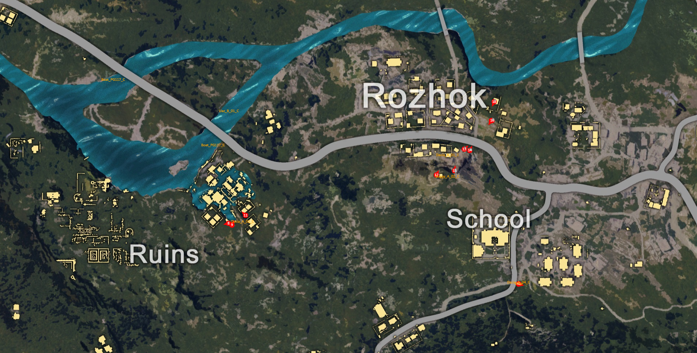

# PUBG-mapper

This map should working with https://github.com/jussihi/PUBG-map-hack



## Feature

* Display player (location, health, facing direction)
* Display item
* Display Vehicle
* Track current player location (change that with `/?id=PLAYERINDEX`)

## Build instructions

1. Install [Nodejs](https://nodejs.org.).
2. To your Working directory and run `npm install` to install package.
3. Run services `node index.js`.
4. The Map will running at `localhost:7890`.

## Configure **PUBG-map-hack**

edit your PUBG-map-hack `CURLWrapper.hpp` file:

1. Change `CURLOPT_URL` to `http://127.0.0.1:7890/`
2. Change `CURLOPT_CUSTOMREQUEST` to `POST`
3. Save and compile.

exp:
```
int sendData(std::string& w_data)
{
    try
    {
        struct curl_slist *headers = NULL;

        headers = curl_slist_append(headers, "Content-Type: application/json");

        curl_easy_setopt(m_curl, CURLOPT_VERBOSE, 0L);
        curl_easy_setopt(m_curl, CURLOPT_HTTPHEADER, headers);
        curl_easy_setopt(m_curl, CURLOPT_URL, "http://127.0.0.1:7890/");  // <---- here
        curl_easy_setopt(m_curl, CURLOPT_CUSTOMREQUEST, "POST");          // <---- here
        // curl_easy_setopt(curl, CURLOPT_TIMEOUT_MS, 30L);
        curl_easy_setopt(m_curl, CURLOPT_WRITEFUNCTION, write_data);
        curl_easy_setopt(m_curl, CURLOPT_POSTFIELDS, w_data.data());
        curl_easy_setopt(m_curl, CURLOPT_NOSIGNAL, 1);

        curl_easy_perform(m_curl);

        curl_slist_free_all(headers);
        curl_easy_reset(m_curl);
    }
    catch (std::exception& e)
    {
        std::cout << e.what() << std::endl;
        return -1;
    }
}
```

## changelog

### 2017-11-4 04:04:44
 * Dead body is a black dot right now.
 * Add a Health pie chart, The player's health has a visual effect.

**to enable this feature you need edit your PUBG-map-hack `GameDataParser.hpp`**:
```
if (std::find(playerIDs.begin(), playerIDs.end(), curActorID) != playerIDs.end())
{
    // ...

    float hp = _Reader->readType<float>(curActor + 0x107C); // <---- here

    w_data["players"].emplace_back(json::object({ { "t", actorTeam }, {"hp", hp}, { "x", actorLocation.X },{ "y", actorLocation.Y }/*,{ "z", actorLocation.Z }*/ })); // <---- and here
}
 ```

### 2017-11-5 21:47:58
* Add fullscreen support (ios safari ONLY).

### 2017-11-6 00:16:33
* Add facing direction arrow.

**to enable this feature you need edit your PUBG-map-hack `GameDataParser.hpp`**:
```
if (std::find(playerIDs.begin(), playerIDs.end(), curActorID) != playerIDs.end())
{
    int64_t rootCmpPtr = _Reader->readType<int64_t>(curActor + 0x180);
    int64_t playerState = _Reader->readType<int64_t>(curActor + 0x3C0);
    Vector3 actorLocation = _Reader->readVec(rootCmpPtr + 0x1A0);
    Vector3 relativeRotation = _Reader->readVec(rootCmpPtr + 0x01EC); // <---- here

    // ...
    
    w_data["players"].emplace_back(json::object({ { "t", actorTeam }, {"hp", hp}, { "x", actorLocation.X },{ "y", actorLocation.Y }, {"r", relativeRotation.Y } })); // <---- and here
}
```
